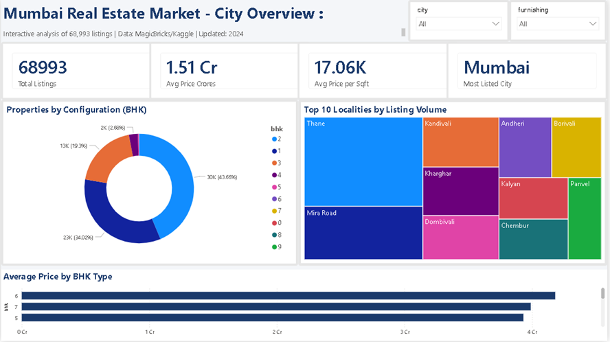
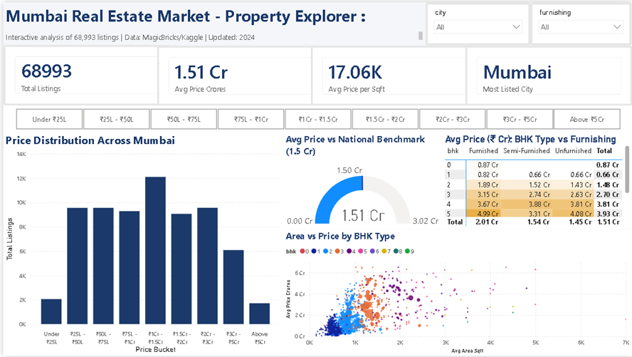

# 🏙️ Mumbai Real Estate Price Intelligence Dashboard

**An end-to-end Data Analytics project — from raw web-scraped data to a live, interactive web application.**

> Built to answer one question: *Where in Mumbai do you actually get value for your money?*

## 🚀 Live Interactive Dashboard

[](https://mumbai-real-estate-dashboard-uqstz6vnolghwwekhiynpr.streamlit.app/)

👆 **Click the badge above to open the fully interactive dashboard** — filter by city, BHK type, furnishing status and price range. All charts update in real-time.

---

## 📊 Dashboard Preview

| Page 1: City Overview | Page 2: Locality Intelligence | Page 3: Property Explorer |
|---|---|---|
|  |  |  |

---

## 🔍 Key Findings

- **68,993 listings** analysed across Mumbai, Navi Mumbai, Thane, and Pune
- **Gamdevi** (South Mumbai) commands the highest price per sqft at ~₹58,000 — approximately **240% above** the Mumbai average of ₹17,062
- **Padgha** emerges as the best-value locality with the lowest price-per-sqft among meaningful market clusters
- The **₹75L – ₹1Cr** price bucket contains the single largest concentration of listings (~12,700 properties), confirming it as Mumbai's most competitive segment
- **Furnished 2 BHKs** command a ₹46,000 premium over unfurnished equivalents on average (₹1.89 Cr vs ₹1.43 Cr) — a data-backed figure most buyers don't know
- Mumbai's average price of **₹1.51 Cr** is exactly at the national benchmark — but this masks extreme micro-market variance from ₹25L studios to ₹5Cr+ penthouses

---

## 🛠️ Tech Stack

| Tool | Purpose |
|------|---------|
| Python 3.12 | Data collection, cleaning, EDA, Web App |
| Playwright | JavaScript-rendered web scraping |
| Pandas + Regex | Data cleaning & feature engineering |
| MySQL | Structured data storage (2 tables: raw → cleaned) |
| Streamlit + Plotly | Live, interactive cloud deployment |
| Power BI Desktop | Initial dashboard prototyping |
| DAX | Custom measures & calculated columns |
| Git + GitHub | Version control & portfolio hosting |

---

## 🏗️ Project Architecture

```text
Phase 1: Data Collection
  └── Playwright scraper → anti-bot pivot → Kaggle dataset (68,993 rows) → MySQL raw_listings

Phase 2: Data Cleaning & EDA
  └── Pandas cleaning → Regex extraction (BHK, locality) → 3.0x IQR outlier removal → cleaned_listings → 8 EDA charts

Phase 3: Interactive Deployment
  └── Pandas DataFrame → Streamlit Web App → Plotly Visualizations → Streamlit Community Cloud